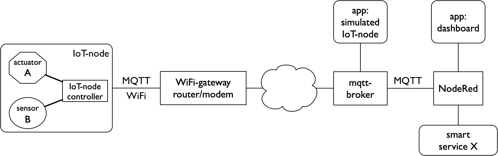

**************
IoT-bouwstenen
**************

We beschrijven hier de verschillende bouwstenen van het Internet of Things.
Met deze bouwstenen kun je op verschillende manieren een *IoT-keten* vormen.

De bouwstenen kun je in twee soorten verdelen:
functionele bouwstenen, die samen de IoT-toepassing vormen;
en communicatie-bouwstenen, die voor de verbinding en interactie tussen de functionele bouwstenen zorgen.
Voor de communicatie en interactie tussen de bouwstenen gebruiken we *protocollen*.

  .. figure:: IoT-keten-functioneel.png
    :width: 600px
    :align: center

    IoT-keten op functioneel niveau

In deze functionele IoT-keten:

* koppelt de *IoT-knoop* de fysieke wereld aan de virtuele/logische wereld, met sensoren en actuatoren;
* zorgen de controllers voor het meten en besturen van de sensoren en actuatoren, mede op basis van input van de diensten (services);
* verwerken de diensten (services) de data van de sensoren; deze stellen de data en kennis van elders beschikbaar aan de controllers;
* zorgt de *web-app* voor de interactie met de gebruikers.

Voor de communicatie en interactie tussen deze bouwstenen gebruiken we het MQTT protocol,
en in sommige gevallen HTTP (het web-protocol).

  IoT-keten met WiFI/MQTT communicatie

We kunnen deze functionele keten verfijnen door communicatiebouwstenen toe te voegen.
Afhankelijk van de radio die de IoT-knoop gebruikt, ziet het begin van de keten er dan anders uit.
In het voorbeeld hierboven gebruiken we WiFi als radio voor de IoT-knoop.

In deze keten:

* zorgt de WiFi-radio voor de verbinding van de IoT-knoop met de rest;
* zorgt de WiFi-gateway voor de koppeling aan het internet;
* verzorgt de MQTT-broker voor het (symmetrisch) doorsturen van de MQTT-berichten tussen de IoT-knoop,
  de NodeRed-controller en eventuele apps.

De WiFi-gateway wordt meestal gecombineerd met andere netwerkfuncties,
zoals router, firewall en modem.

.. rubric:: Functionele bouwstenen

IoT-knoop
=========

Een *IoT-knoop* koppelt de fysieke wereld aan de virtuele wereld.
Zo'n knoop omvat gewoonlijk:

* sensoren, om in de fysieke wereld te meten;
* actuatoren, om in de fysieke wereld te sturen;
* een microcontroller ("computer op een chip") voor de besturing van de IoT-knoop;
* communicatie, vaak draadloos (radioverbinding)
* energie, voor draadloze knopen in de vorm van een batterij, soms aangevuld met *energy harvesting*.

.. figure:: IoT-knoop-0.png
  :width: 400px
  :align: center

  Een IoT-knoop

In de voorbeelden gebruiken we een IoT-knoop met de volgende sensoren/actuatoren:

* een of twee LEDs - als actuatoren
* twee drukknoppen - als "event" sensoren
* sensoren voor: temperatuur, luchtdruk en lichtniveau

Voor de draadloze communicatie gebruiken we verschillende radio's (WiFi, RFM69, LoRa).
De eisen die het "ding" stelt aan bitrate, bereik, mobiliteit en energieverbruik bepalen de keuze voor de radio.

Voor de microcontroller voor de besturing zijn er ook meerdere alternatieven, zoals Atmega AVR (Arduino), ESP8266, ESP32, ARM.
De keuze voor de microcontroller hangt meer af van de eigen voorkeur en omstandigheden dan van de eisen van de toepassing.
We gaan hier niet verder in op deze keuzemogelijkheden.

De figuur hierboven geeft de verschillende onderdelen weer van een IoT-knoop "kit":
sensoren/actuatoren, controller, radio, batterij.
In de praktijk worden deze onderdelen verder geïntegreerd.

NodeRed
=======

.. figure:: Nodered-chat-flow.png
   :width: 500 px
   :align: center

   NodeRed Chat flow

Als lokale of globale controller gebruiken we NodeRed.
IoT-toepassingen combineren vaak data uit verschillende bronnen:
vanuit IoT-knopen, maar ook uit databases of andere datastromen.
Om deze ruwe data bruikbaar te maken voor de gebruikerstoepassing,
kun je deze eerst door externe diensten (Data Science, Artificial Intelligence, enz.) laten bewerken.
Deze databronnen, diensten en gebruikerstoepassingen gebruiken verschillende protocollen en formaten.
Met NodeRed knoop je deze verschillende onderdelen samen op een grafische manier.
Daar voeg je je eigen besturing aan toe.
Een NodeRed-server is in onze voorbeelden vrijwel altijd onderdeel van de IoT-keten.

App: dashboard
==============

.. figure:: Nodered-dashboard-display-0.png
   :width: 500 px
   :align: center

   Web-app voorbeeld: dashboard

Uiteindelijk komen deze data terecht bij een webtoepassing (web-app),
als gebruikersinterface in de IoT-keten.
Een voorbeeld van een eenvoudige toepassing is een *dashboard*, met een samenvatting van de gegevens van de IoT-knopen.

In onze voorbeeld-toepassing werken we met een eenvoudig dashboard met de gegevens van één IoT-knoop.
Dit dashboard maken we met NodeRed: we gebruiken deze dan (ook) als webserver.
Via dit dashboard kunnen we ook de actuators van de IoT-knoop bedienen.

----

.. rubric:: Communicatie-bouwstenen

Radio
=====

Voor de verbinding tussen een draadloze IoT-knoop en het internet kun je kiezen uit verschillende radio's.
Deze radio's verschillen in hun energieverbruik (power), bereik en bitrate.
In deze module maken we kennis met enkele IoT-radio's.
De onderstaande tabel geeft de belangrijkste karakteristieken.

+-----------+-----------+-------------------------+---------------+
| **radio** | **power** | **bereik**              | **bitrate**   |
+-----------+-----------+-------------------------+---------------+
| WiFi      | medium    | lokaal bereik (10-50m)  | MBytes/s      |
+-----------+-----------+-------------------------+---------------+
| WiFi      | medium    | lokaal bereik (10-50m)  | Mbytes/s      |
+-----------+-----------+-------------------------+---------------+
| RFM69     | low       | lokaal bereik (50-200m) | 50kbits/s (*) |
+-----------+-----------+-------------------------+---------------+
| LoRa      | low       | niet-lokaal (enkele km) | 1 kbit/s (*)  |
+-----------+-----------+-------------------------+---------------+

(*) voor LoRa is de bitrate nog lager bij een groot bereik.
Bovendien mogen RFM69 en Lora-radio's max. 1% van de tijd zenden.

**Opmerking**: in deze lijst ontbreekt nog Bluetooth Low Energy (BLE).
We proberen deze in een toekomstige versie van dit materiaal toe te voegen.

Gateway
=======

Soms kunnen we de IoT-knopen niet rechstreeks in het internet verbinden,
bijvoorbeeld omdat deze knopen een ander (eenvoudiger) protocol gebruiken.
We gebruiken dan een *gateway* om het IoT-knoop-protocol om te zetten naar het IP-protocol, en omgekeerd.

.. figure:: IoT-0-stacks-gateway.png
   :width: 400 px
   :align: center

   IoT-gateway

Bij een dergelijke omzetting (protocolconversie) moeten we rekening houden met de complete protocolstack,
tot en met de toepassing.
Voorbeeld: in de RFM69-gateway moeten we de berichten van de IoT-knopen omzetten naar MQTT-berichten in het formaat van onze toepassing.

MQTT-broker
===========

We gebruiken het MQTT-protocol om IoT-knopen te koppelen aan de toepassing (web-app).
MQTT gebruikt een *Publish-Subscribe* interactie - in plaats van de Client-Server interactie van het web (HTTP).
De MQTT-broker verbindt de verschillende soorten clients op een symmetrische manier,
van IoT-knopen tot controllers en servers.

.. figure:: MQTT.png
   :width: 400 px
   :align: center

   Publish-subscribe interactie (MQTT)

Een MQTT-client *publiceert* een MQTT-bericht naar de broker, gelabeld met een bepaald *topic*.
De MQTT-broker stuurt dit bericht door ("push") naar alle clients
die eerder via *subscribe* hun interesse voor berichten in dit topic aangegeven hebben.
