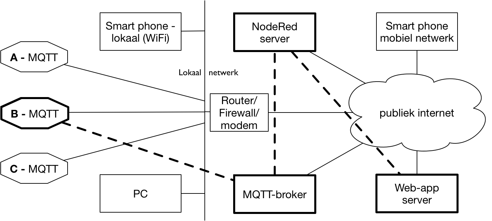

**********
IoT-ketens
**********

.. admonition:: Concepten en leerdoelen

  * client-server, "pull" interactie; "polling" om veranderingen te detecteren
  * publish-subscribe  interactie; "push" vanuit de broker

In het voorgaande hebben we de afzonderlijke onderdelen van het Internet of Things beschreven.
Hieronder behandelen we een aantal voorbeelden om deze onderdelen samen te stellen tot een (deel)keten.
Dit hoofdstuk is vooral bedoeld inleiding en overzicht.
In de volgende hoofdstukken werken we deze voorbeelden verder uit, met praktische opdrachten.
Je kunt daarbij dit hoofdstuk als naslagwerk gebruiken.

Het Internet of Things heeft veel verschillende vormen:
dit komt onder andere doordat er zoveel verschillende soorten "dingen" zijn,
die in veel verschillende omgevingen voorkomen.
Voor een bepaalde IoT-toepassing moet je dan passende onderdelen zoeken.

IoT-knoop als webserver
=======================

.. figure:: IoT-webserver-1.png
   :width: 400 px
   :align: center

   IoT-knoop als webserver

Een IoT-knoop met ingebouwde webserver kun je direct vanuit een browser bedienen.
De toepassing (web-app) komt dan van de IoT-knoop zelf.
Sommige netwerkapparaten, zoals netwerkprinters en routers, gebruiken deze aanpak.
De huidige microcontrollers zijn krachtig genoeg voor een kleine webserver.

Alleen apparaten in het lokale netwerk hebben toegang tot zo'n lokale webserver.
Zonder extra voorzieningen is een lokale webserver niet vanuit het publieke internet toegankelijk.

Een webserver gebruikt het HTTP-protocol, in een *client-server interactie*.
De webclient, in dit voorbeeld de smartphone, haalt (*pull*) de data van de webserver (hier: IoT-knoop B).
Om na te gaan of een sensorwaarde veranderd is, moet de smartphone regelmatig de IoT-knoop raadplegen (*polling*).

Publieke MQTT-broker
====================

.. figure:: IoT-nobridge-1.png
   :width: 500 px
   :align: center

   IoT-knoop met publieke MQTT broker

Het MQTT-protocol is beter geschikt voor het IoT dan het webprotocol HTTP.
Een IoT-knoop met een IP-protocolstack kan rechtstreeks communiceren met een publieke MQTT-broker.
Toepassingen (web-apps) kunnen dan via de MQTT-broker communiceren met de IoT-knoop.
In dit voorbeeld gaan we uit van IoT-knopen die via WiFi in het lokale netwerk verbonden zijn;
deze communiceren via MQTT met de broker in het publieke internet.

De interactie tussen de IoT-knopen en de web-apps met de MQTT-broker gebruikt het ''publish/subscribe''-principe:
clients kunnen berichten publiceren ("push") naar de broker, onder een bepaald onderwerp (topic);
clients kunnen zich ook abonneren op de berichten van een onderwerp.
De broker stuuurt de berichten door ("push") naar de clients die op dit onderwerp geabonneerd zijn.
Voor de broker is er geen wezenlijk verschil tussen de clients:
IoT-knopen en web-apps hebben hier dezelfde client-broker relatie.

In het voorbeeld ''publiceert'' de IoT-knoop de sensorwaarden naar de broker;
deze stuurt de sensorwaarden door naar de web-app die zich eerder op deze sensorwaarden geabonneerd heeft (''subscibe'').
Omgekeerd kan de web-app actuator-berichten naar de broker publiceren;
de IoT-knoop abonneert zich op de (eigen) actuatorwaarden.

.. rubric:: NodeRed als IoT-schakelstation

   IoT-knoop met publieke MQTT broker en NodeRed

In dit voorbeeld hierboven communiceert de web-app rechtstreeks met de MQTT-broker.
Vaak is het handiger om NodeRed als schakelstation te gebruiken:
NodeRed communiceert dan met de MQTT-broker, en de web-app met de NodeRed-server.

Lokale broker als bridge
========================

.. figure:: IoT-MQTT-bridge-1.png
   :width: 500 px
   :align: center

   IoT-knoop met lokale MQTT broker/bridge

Vaak is het handig om een lokale MQTT-broker te plaatsen tussen de lokale IoT-knopen en de publieke MQTT-broker.
De IoT-knopen communiceren via het lokale (WiFi) netwerk met de lokale broker.
De lokale broker communiceert met lokale toepassingen.
Daarnaast fungeert de lokale broker als bridge naar de publieke MQTT-broker.
Deze bridge scheidt zo het lokale IoT/MQTT-verkeer en het publieke IoT/MQTT-verkeer.

Een zinvolle toevoeging is een lokale NodeRed-server:
daarmee kun je bijvoorbeeld verschillende lokale IoT-netwerken en toepassingen koppelen.

Lokale gateway
==============

.. figure:: IoT-lokale-gateway-1.png
   :width: 500 px
   :align: center

   IoT-knopen met lokale gateway

Om aan low-power-eisen te voldoen gebruiken IoT-knopen soms eenvoudige niet-IP-protocollen.
Een lokale gateway zorgt dan voor de protocolconversie,
in dit geval tussen het lokale formaat van de IoT-knopen en het MQTT-toepassingsformaat.
Deze lokale gateway verzorgt de communicatie met de publieke MQTT-broker,
of met de lokale MQTT broker die ook als bridge fungeert.
Als voorbeeld gebruiken we een eenvoudige pakketradio (RFM69) met een bereik van enkele honderden meters.

Publieke gateway
================

.. figure:: IoT-publieke-gateway-1.png
   :width: 500 px
   :align: center

   IoT-knopen met publieke gateway

Voor low-power IoT-knopen die mobiel zijn in een groot gebied is het gebruik van een publieke gateway handig.
Dit kun je vergelijken met het gebruik van publieke zendmasten voor mobiele telefonie.
Een voorbeeld van een provider met publieke gateways is The Things Network (TTN, op basis van LoRaWAN).
De publieke TTN-gateways communiceren met een TTN-server/broker.
Toepassingen (web-apps) communiceren bijvoorbeeld via MQTT met deze TTN-server/broker.

We zullen in de volgende hoofdstukken deze verschillende IoT-ketens verder uitwerken.
