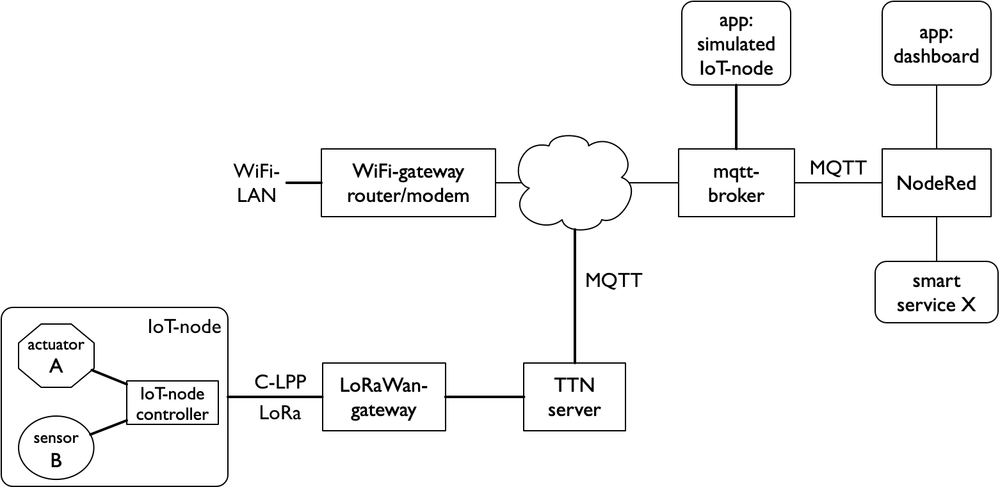

**********
IoT-ketens
**********

.. admonition:: Concepten en leerdoelen

  * IoT-keten met functionele en communicatie-bouwstenen

In het voorgaande hebben we de afzonderlijke bouwstenen van het Internet of Things beschreven.
Hieronder geven we een overzicht van een aantal IoT-ketens op basis van deze bouwstenen.
In de volgende hoofdstukken werken we deze voorbeelden verder uit.

De keuze voor een bepaalde radio, op grond van de eisen van de toepasssing,
heeft een grote invloed op het begin van de keten: de "edge".
Een andere bepalende factor is de verdeling (distributie) van de controller-functies.

IoT-knoop als webserver
=======================

.. figure:: IoT-keten-WiFi-HTTP.png
   :width: 500 px
   :align: center

   IoT-WiFi-HTTP keten: IoT-knoop als webserver

Een IoT-knoop met ingebouwde webserver kun je direct vanuit een browser bedienen.
De toepassing (web-app) komt dan van de IoT-knoop zelf.
Sommige netwerkapparaten, zoals netwerkprinters en routers, gebruiken deze aanpak.

De communicatie verloopt via het lokale netwerk:
alleen apparaten in dit netwerk hebben toegang tot zo'n lokale webserver.

Een webserver gebruikt het HTTP-protocol, in een *client-server interactie*.
De webclient (browser) haalt (*pull*) de data van de webserver (de IoT-knoop).

IoT-knoop als MQTT-client
=========================

.. figure:: IoT-keten-WiFi-MQTT.png
  :width: 600 px
  :align: center

  IoT-MQTT keten met publieke MQTT-broker

Het MQTT-protocol is beter geschikt voor het IoT dan het webprotocol HTTP.
Een IoT-knoop kan als MQTT-client rechtstreeks communiceren met een publieke MQTT-broker.
Toepassingen (web-apps) en controllers in het publieke internet kunnen dan via de MQTT-broker communiceren met de IoT-knoop.

De IoT-knoop  *publiceert* de sensorwaarden naar de broker;
deze stuurt de sensorwaarden door naar de MQTT-clients die zich eerder op deze sensorwaarden geabonneerd hebben (*subscribe*).
De IoT-knoop abonneert zich op de eigen actuator-berichten: andere clients kunnen deze dan aansturen.

We gebruiken in deze keten NodeRed als globale controller,
verbonden met web-apps zoals een dashboard, en met externe diensten.

Lokale broker/controller
========================

.. figure:: IoT-keten-local-broker.png
   :width: 600 px
   :align: center

   IoT-knoop met lokale MQTT broker en NodeRed-controller

Vaak is het handig om een lokale MQTT-broker te plaatsen tussen de lokale IoT-knopen en de publieke MQTT-broker.
Een IoT-knoop communiceert via het lokale (WiFi) netwerk met de lokale broker.
De lokale broker communiceert met lokale toepassingen.
Daarnaast fungeert de lokale broker als bridge naar de publieke MQTT-broker.
Deze bridge scheidt zo het lokale IoT/MQTT-verkeer en het publieke IoT/MQTT-verkeer.

Een lokale broker kun je combineren met een lokale controller,
bijvoorbeeld in de vorm van een NodeRed-server.
Daarmee kun je lokale IoT-knopen en toepassingen direct koppelen,
naast externe controllers en diensten.
De controllers kunnen via MQTT met elkaar communiceren.

RFM69 netwerk met lokale gateway
================================

.. figure:: IoT-keten-RFM69.png
   :width: 600 px
   :align: center

   IoT-RFM69 keten

De RFM69-radio is een voorbeeld van een energiezuinige radio met een bereik tot enkele honderden meters.
Deze radio biedt pakketcommunicatie met een eigen niet-IP protocol.
Een lokale gateway zorgt dan voor de protocolconversie naar MQTT.
Deze lokale gateway communiceert als MQTT-client met de MQTT-broker.

LoRaWan-keten met publieke gateway
==================================

  IoT-LoRaWan keten met publieke gateway

Voor low-power IoT-knopen die mobiel zijn in een groot gebied is een LoRaWan netwerk,
op basis van de LoRa radio, geschikt.
Deze radio heeft een bereik tot enkele kilometers.
Een LoRaWan-gateway is in een groot gebied bereikbaar:
dit kun je vergelijken met een publieke zendmast voor mobiele telefonie.
Een voorbeeld van een LoRaWan-provider is The Things Network (TTN).
Een LoRaWan-knoop communiceert met een publieke TTN-gateways;
deze communiceert de TTN-server/broker.
Toepassingen (web-apps) communiceren bijvoorbeeld via MQTT met deze TTN-server/broker.
