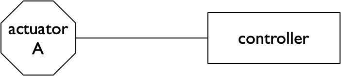
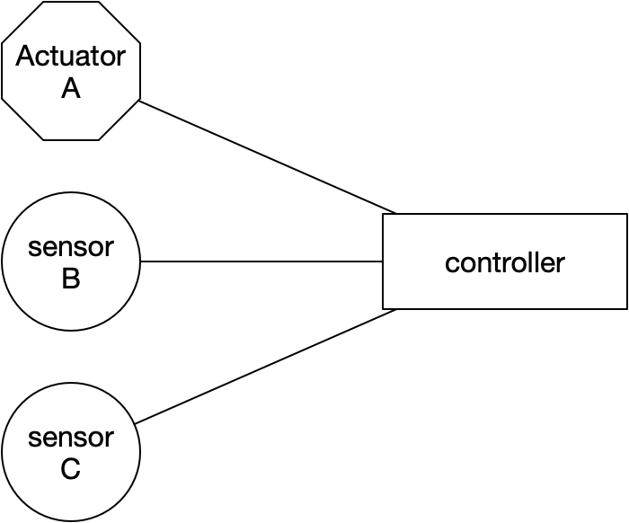
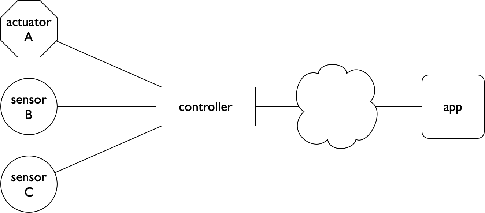
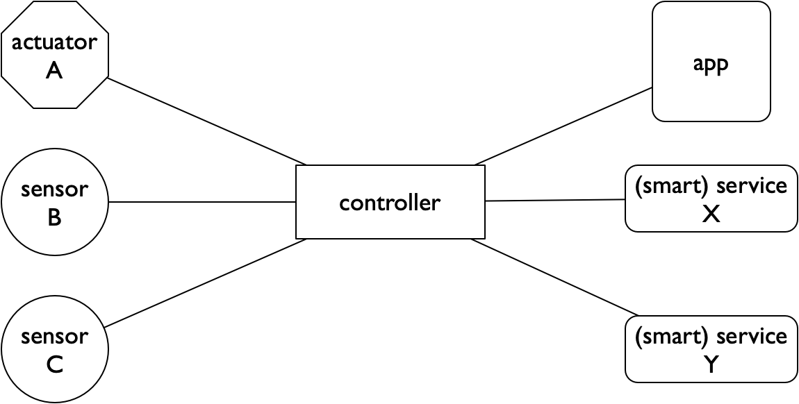
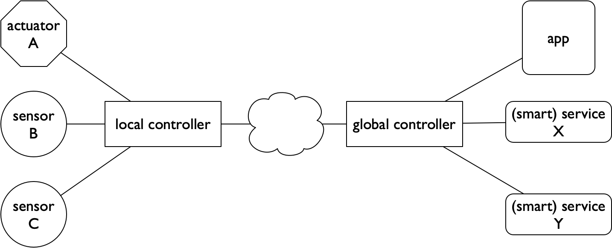
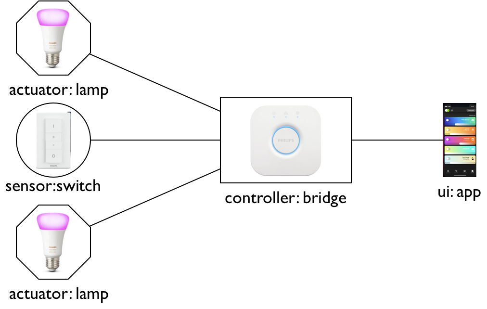
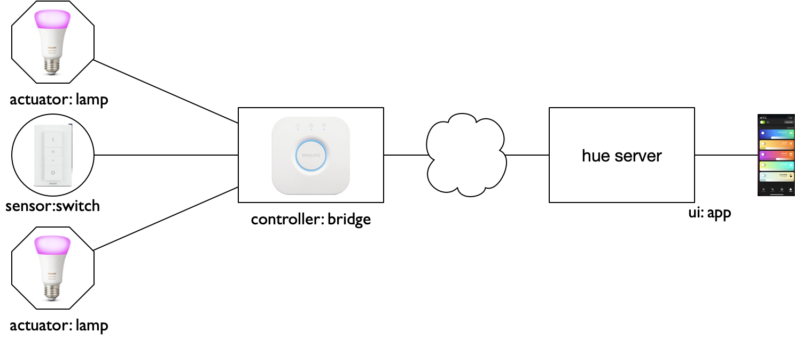

*********************
Voorbeelden in detail
*********************

We geven hier enkele voorbeelden in meer detail.
Daarna geven we een grotere lijst van voorbeelden waarvan je de details elders in het web kunt vinden.

Voorbeeld: watersproeier
========================

Als voorbeeld van een IoT-toepassingen kijken we naar het besproeien van een sportveld.
We beginnen met een eenvoudige, lokale oplossing.
Deze breiden we stapsgewijs uit naar een "slimme" oplossing door steeds meer aspecten van het internet of things te gebruiken.

Actuator en controller
----------------------

De eerste oplossing is een automatische sproei-installatie.
Deze bestaat uit sproeiers (*actuatoren*) en de besturing daarvan;
een dergelijke besturingscomputer noemen we een *controller*.
De eenvoudigste automatische besturing is op basis van tijd, bijvoorbeeld:
besproei de komende week van 22:00 uur tot 4:00 uur.

Met deze oplossing kunnen we sproeien op momenten dat dit het meeste zin heeft,
zonder dat we er zelf bij hoeven te zijn.

.. admonition:: Wat is een controller?

  Een controller is een besturingscomputer.
  Dit kan variëren van een *microcontroller*: een complete computer op een chip,
  met analoge en digitale aansluitingen voor sensoren en actuatoren,
  tot een NodeRed-server.
  In NodeRed kun je allerlei protocollen en diensten, van laag tot hoog niveau,
  aan elkaar verbinden en combineren met regels voor de besturing.

Sensoren
--------

Deze eerste  oplossing is nog niet optimaal.
Een nadeel is dat er volgens dit schema altijd gesproeid wordt - ook als de grond niet droog is, of als het regent.
Dit betekent op z'n minst een verspilling van water;
bovendien kan  het veld hierdoor te drassig worden, wat ook niet de bedoeling is.

We kunnen deze problemen voorkomen door (lokale) *sensoren* te gebruiken,
om de bodemvochtigheid te meten, om te meten of het regent,
en bijvoorbeeld om de luchtvochtigheid en de temperatuur te meten.
Hiermee kunnen we al zuiniger met water omspringen.

Aan het internet
----------------

Als volgende stap *verbinden we de controller met het internet*.
Hiermee kunnen we de installatie *op afstand bedienen*, via een app,
waarin we ook in een dashboard de gegevens van de sensoren kunnen bekijken.

"Slimme" diensten
-----------------

Als de controller verbonden is aan het internet,
kunnen we bij de besturing ook gebruik maken van *diensten elders in het internet*,
zoals bijvoorbeeld de weersverwachting:
het geen zin om te sproeien als er regen verwacht wordt.
Op deze manier kunnen we nog meer water besparen.

Door gebruik te maken van de gegevens van de sensoren over langere tijd,
en door deze te combineren met gegevens van sproei-installaties elders,
kunnen we het algoritme voor het besproeien steeds verder optimaliseren.
Dit is een voorbeeld van het combineren van het Internet of Things met Data Science (Big Data).

Uiteindelijk wil je een sproeisysteem dat optimaal gebruik maakt van de omstandigheden.
Je wilt daarmee het gras zo laten groeien dat het goed gebruik maakt van het water in de bodem -
bijvoorbeeld door lange wortels te ontwikkelen.
Dat betekent bijvoorbeeld dat je niet altijd moet sproeien als alleen de bovenste laag van de bodem droog is.
Hiervoor is kennis nodig van de manier waarop gras groeit, en van de lokale bodem- en weersomstandigheden.
Externe diensten spelen daarvoor een belangrijke rol.

Meerdere controllers
--------------------

Vaak heeft het zin om controllers op meerdere niveaus te gebruiken,
bijvoorbeeld een controller direct bij de sensoren/actuatoren,
een controler in de buurt van de eigenlijke toepassing,
en een controller die bereikbaar is in het publieke internet.

De lokale controller(s) zorgen voor lokale autonomie,
voor snelle beslissingen (door lage latency),
en verminderen de druk op de communicatie naar en het rekenwerk in de *cloud*.
Omdat je dit kunt zien als een lokaal verlengstuk van de *cloud* heet dit wel *fog computing*.

De globale controller zorgt voor de bereikbaarheid in het internet,
en voor de koppeling met diensten elders.

Eisen aan de communicatie
-------------------------

We gaan in een volgend hoofdstuk dieper in op de manier waarop we de verschillende onderdelen kunnen verbinden.
Op basis van kennis van de toepassing kunnen we al wel de eisen aan de communicatie formuleren.
Enkele voorbeelden van eisen:

* bandbreedte (bitrate): voor de toepassing kunnen we bepalen hoeveel berichten we in een bepaalde tijd willen sturen,
  en wat de omvang van die berichten is (in bits of in bytes);
* latency (vertraging): in het bijzonder bij een besturingstoepassing moeten we ervoor zorgen
  dat de tijd tussen het signaleren van een *event* (gebeurtenis) door een sensor en
  het aansturen van de actuator(en) niet te groot is:
  de maximale reactietijd wordt bepaald door de snelheid van het (fysieke) proces dat je aanstuurt.
* draadloos of bedraad: veel toepassingen eisen dat de verbinding tussen de sensoren/actuatoren en de controller draadloos is:
  draden belemmeren bijvoorbeeld de plaatsing of de beweging van de sensoren, en daarmee van het "ding" waaraan deze sensoren gekoppeld zijn.
* andere eisen, bijvoorbeeld beveiliging en privacy;
  je wilt bijvoorbeeld niet dat een besturing door anderen overgenomen kan worden.

In het voorbeeld van de sproeier hebben we de volgende eisen:

* bandbreedte (bitrate):
    * bodemvochtigheid: 1 bericht per 5-10 minuten, 1 byte per bericht;
    * actuator: 1 bericht per 30 minuten(?), 1 byte per bericht;
    * temperatuursensor: 1 bericht per 5-10 minuten, 1 byte per bericht;
    * regensensor: 1 bericht per 5-10 minuten, 1 byte per bericht;
* latency: deze is niet kritisch (minuten), het fysische proces van besproeien van een grasveld is langzaam.
* draadloos of bedraad: de verbinding tussen de controller, de actuator(s) en de sensoren is bij voorkeur draadloos.

.. admonition:: Hoeveel bits heb je nodig?

  Bij het bepalen van het aantal bits (of bytes) voor een sensormeting of een actuator-aansturing
  moet je weten (i) wat het *bereik* is, en (2) wat de vereiste *precisie* is.

  Bijvoorbeeld: je wilt temperatuur meten in het bereik -20..50 (Celcius),
  met een precisie van 0,5 graad.
  Je gebruik dan het bereik -40..100, waarbij je dit getal later door 2 deelt.

  Voor een getal in het bereik 0..255 heb je 8 bits nodig (1 byte).
  Je kunt dit bereik ook verschuiven, bijvoorbeeld -128..127, of -100..155.
  Het aantal bits blijft dan gelijk.
  Je kunt het bereik ook schalen (de komma verschuiven), bijvoorbeeld 0,0..25,5 (Celsius).
  Vaak is het bij deze schaling handiger om door een macht van 2 te delen,
  dan door een macht van 10.

  Je kunt ook met grotere getallen werken: 0..1023 (10 bits), 0..1000000 (20 bits), enz.

Samenvatting
------------

Samenvattend zien we de volgende stappen:

1. automatisch besturen van actuatoren met een controller;
2. aansluiten van sensoren op de controller, om een slimmere besturing mogelijk te maken;
3. aansluiten van de controller op het internet, voor bewaken (monitoring) en besturen op afstand - via een app;
4. gebruik van diensten in het internet om tot een "slimme oplossing" te komen.

Elke volgende stap helpt om meer water te besparen en om een beter sproei-resultaat te krijgen.
De eerste stappen zijn voorbeelden van traditionele automatisering.
De stappen 3 en 4 zijn voorbeelden van het internet of things:
de verbinding met het internet geeft veel extra mogelijkheden.

Voorbeeld: verlichting
======================

Als volgend voorbeeld gebruiken we een domotica-voorbeeld: verlichting in huis.
We behandelen dit aan de hand van het Philips Hue systeem.

Actuatoren, sensoren en controller
----------------------------------

De actuatoren zijn in dit geval de lampen.
Deze kun je bedienen met drukknoppen en met (bewegings)sensoren.
De controller ("bridge") zorgt voor de koppeling tussen de sensoren en de actuatoren.
De controller heeft geen eigen user interface:
hiervoor gebruik je de app die via het lokale (WiFi) netwerk verbinding maakt met de controller.

Aan het internet
----------------

Je kunt met de app de lampen ook op afstand bedienen, via het internet.
Hiervoor maakt de app contact met de hue-server/controller in het publieke internet,
die weer contact maakt met de lokale controller.

Andere controllers
------------------

De lokale controller is in eerste instantie bedoeld voor verlichting.
Je kunt de lokale controller ook verbinden met andere "domotica"-controllers voor bijvoorbeeld verwarming, koeling, veiligheid e.d.
Voorbeelden van controller-software voor domotica-toepassingen zijn OpenHAB (https://www.openhab.org) en Home Assist (https://www.home-assistant.io).
Via de hue-webserver kun je verbinding maken met controller-diensten als Apple Home Kit en Amazon Alexa.

.. todo::

  * figuur van Hue met andere controller(s)

Voorbeeld: monitoring
=====================

In de bovenstaande voorbeelden is er steeds sprake van besturing (*control*), via actuatoren.
Ook met alleen sensoren, voor bewaking (*monitoring*), zijn al veel zinvolle IoT-toepassingen te maken.

.. todo::

  * Monitoring voorbeeld(en)
