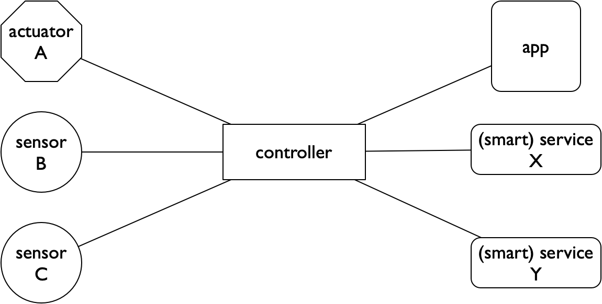

***********
Voorbeelden
***********

We geven hier enkele uitgebreidere voorbeelden.
Verder in dit hoofdstuk geven we een grotere lijst van voorbeelden waarvan je de details elders in het web kunt vinden.

Voorbeeld: watersproeier
========================

Als voorbeeld van een IoT-toepassingen kijken we naar het besproeien van een sportveld.
We beginnen met een eenvoudige, lokale oplossing.
Deze breiden we stapsgewijs uit naar een "slimme" oplossing door steeds meer aspecten van het internet of things te gebruiken.

Actuator en controller
----------------------

.. figure:: actuator-controller.png
  :width: 300px
  :align: center

De eerste oplossing is een automatische sproei-installatie.
Deze bestaat uit sproeiers (*actuatoren*) en de besturing daarvan;
een dergelijke besturingscomputer noemen we een *controller*.
De eenvoudigste automatische besturing is op basis van tijd, bijvoorbeeld:
besproei de komende week van 22:00 uur tot 4:00 uur.

Met deze oplossing kunnen we sproeien op momenten dat dit het meeste zin heeft,
zonder dat we er zelf bij hoeven te zijn.

.. admonition:: Wat is een controller?

  Een controller is een besturingscomputer.
  Dit kan variëren van een *microcontroller*: een complete computer op een chip,
  met analoge en digitale aansluitingen voor sensoren en actuatoren,
  tot een NodeRed-server.
  In NodeRed kun je allerlei protocollen en diensten, van laag tot hoog niveau,
  aan elkaar verbinden en combineren met regels voor de besturing.

Sensoren
--------

.. figure:: actuator-sensor-controller.png
  :width: 300px
  :align: center

Deze eerste  oplossing is nog niet optimaal.
Een nadeel is dat er volgens dit schema altijd gesproeid wordt - ook als de al grond nat is van de regen.
Dit betekent op z'n minst een verspilling van water;
bovendien kan  het veld hierdoor te drassig worden, wat ook niet de bedoeling is.

We kunnen deze problemen voorkomen door (lokale) *sensoren* te gebruiken,
om de bodemvochtigheid te meten, om te meten of het regent,
en bijvoorbeeld om de luchtvochtigheid en de temperatuur te meten.
Hiermee kunnen we al zuiniger met water omspringen.

Aan het internet
----------------

.. figure:: controller-internet.png
  :width: 500px
  :align: center

Als volgende stap *verbinden we de controller met het internet*.
Hiermee kunnen we de installatie *op afstand bedienen*, via een app,
waarin we ook in een dashboard de gegevens van de sensoren kunnen bekijken.

"Slimme" diensten
-----------------

Als de controller verbonden is aan het internet,
kunnen we bij de besturing ook gebruik maken van *diensten elders in het internet*,
zoals bijvoorbeeld de weersverwachting:
het geen zin om te sproeien als er regen verwacht wordt.
Op deze manier kunnen we nog meer water besparen.

Door gebruik te maken van de gegevens van de sensoren over langere tijd,
en door deze te combineren met gegevens van sproei-installaties elders,
kunnen we het algoritme voor het besproeien steeds verder optimaliseren.
Dit is een voorbeeld van het combineren van het Internet of Things met Data Science (Big Data).

Uiteindelijk wil je een sproeisysteem dat optimaal gebruik maakt van de omstandigheden.
Je wilt daarmee het gras zo laten groeien dat het goed gebruik maakt van het water in de bodem -
bijvoorbeeld door voldoend lange wortels te ontwikkelen.
Dat betekent dat je niet altijd moet sproeien als alleen de bovenste laag van de bodem droog is.
Hiervoor is kennis nodig van de manier waarop gras groeit, en van de lokale bodem- en weersomstandigheden.
Externe diensten spelen daarvoor een belangrijke rol.

Meerdere controllers
--------------------

.. figure:: IoT-node-controller-controller.png
    :width: 600px
    :align: center

Vaak heeft het zin om controllers op meerdere niveaus te gebruiken,
bijvoorbeeld een (micro)controller direct bij de sensoren/actuatoren in een *IoT-knoop*,
een controller in de buurt van de "dingen" waaraan je meet en stuurt,
en een controller die bereikbaar is in het publieke internet.

De IoT-knoop-controller en de lokale controller zorgen voor lokale autonomie en (daardoor) grotere betrouwbaarheid,
voor snelle beslissingen (door lage latency vanwege de kleine afstand),
verminderen de druk op de communicatie met en het rekenwerk in de *cloud*,
en maken een betere beveiliging mogelijk.
Omdat je het rekenwerk in de lokale controllers kunt zien als een lokaal verlengstuk van de *cloud* heet dit wel *fog computing*.

De globale controller zorgt voor de bereikbaarheid in het internet,
en voor de koppeling met diensten elders.

Dit gebruik van meerdere controllers is een voorbeeld van *distributie* van functionaliteit in een netwerk.

Samenvatting
------------

Samenvattend zien we de volgende stappen:

1. automatisch besturen van actuatoren met een controller;
2. aansluiten van sensoren op de controller, om een slimmere besturing mogelijk te maken;
3. aansluiten van de controller op het internet, voor bewaken (monitoring) en besturen op afstand - via een app;
4. gebruik van diensten in het internet om tot een "slimme oplossing" te komen.

Elke volgende stap helpt om meer water te besparen en om een beter sproei- en groeiresultaat te krijgen.
De eerste stappen zijn voorbeelden van traditionele automatisering.
De stappen 3 en 4 zijn voorbeelden van het internet of things:
de verbinding met het internet geeft veel extra mogelijkheden.

Voorbeeld: verlichting
======================

Als volgend voorbeeld gebruiken we een domotica-voorbeeld: verlichting in huis.
We behandelen dit aan de hand van het Philips Hue systeem.

Actuatoren, sensoren en controller
----------------------------------

.. figure:: hue-local.png
    :width: 400px
    :align: center

De actuatoren zijn in dit geval de lampen.
Deze kun je bedienen met drukknoppen en met (bewegings)sensoren.
De controller ("bridge") zorgt voor de koppeling tussen de sensoren en de actuatoren.
De controller heeft geen eigen user interface:
hiervoor gebruik je de app die via het lokale (WiFi) netwerk verbinding maakt met de controller.

Aan het internet
----------------

.. figure:: hue-server.png
    :width: 500px
    :align: center

Je kunt met de app de lampen ook op afstand bedienen, via het internet.
Hiervoor maakt de app contact met de hue-server/controller in het publieke internet,
die weer contact maakt met de lokale controller.

We hebben hier te maken met 3 lagen van controllers:

* de lampen en de schakelaars zijn IoT-knopen, met lokaal sensor(en)/actuator(en),
  een microcontroller, en een radio;
* de bridge is de lokale controller;
* de server in het publieke internet is de globale controller.

Andere controllers
------------------

De lokale controller is in eerste instantie bedoeld voor verlichting.
Je kunt de lokale controller ook verbinden met andere "domotica"-controllers voor bijvoorbeeld verwarming, koeling, veiligheid e.d.
Voorbeelden van controller-software voor domotica-toepassingen zijn OpenHAB (https://www.openhab.org) en Home Assist (https://www.home-assistant.io).
Via de hue-webserver kun je verbinding maken met controller-diensten als Apple Home Kit en Amazon Alexa.

.. todo::

  * figuur van Hue met andere controller(s)

Voorbeeld: monitoring
=====================

.. figure:: DBveld.jpg
    :width: 200px
    :align: right

In de bovenstaande voorbeelden is er steeds sprake van besturing (*control*), via actuatoren.
Ook met alleen sensoren, voor bewaking (*monitoring*), zijn al veel zinvolle IoT-toepassingen te maken.
Als voorbeeld gebruiken we het bewaken op afstand van een bijenkast.

Een imker (bijenhouder) heeft vaak meerdere bijenkasten, verspreid over een groot gebied.
Het loont de moeite om de activiteit van de bijen op afstand te kunnen bewaken (*monitoring*).
De imker kan dan de gezondheid van zijn bijenvolken continu in de gaten houden,
en op tijd ingrijpen als er dingen mis dreigen te gaan.

De stichting `Beep <https://beep.nl>`_ ontwikkelt een open-source systeem voor het bewaken van bijenkast,
en voor het bijhouden van de belangrijkste gegevens in een app.
De gegevens van het automatische meetsysteem combineer je in de app met gegevens van eigen inspecties.
Het automatische meetsysteem stuurt enkele keren per uur de belangrijkste gegevens op via een LoRa (long range) IoT-netwerk.

.. figure:: beep-lora-internet.png
    :width: 500px
    :align: center

Voor een imker zijn bijvoorbeeld de volgende gegevens van belang:

* de buitentemperatuur en de luchtvochtigheid in de omgeving van de kast;
* de temperatuur in de kast (broedtemperatuur);
* het gewicht van de kast: als de bijen de kast verlaten neemt het gewicht af;
  als de bijen terugkomen met nectar neemt het gewicht toe;
* het geluid in de kast.
  Als een bijenvolk door indringers beroofd wordt van de voedselvoorraad,
  kun je dit zien aan de combinatie van gewicht en geluid.

Zie de presentatie hierover: https://www.slideshare.net/martenschoonman/beep-bee-app-overview-presentation-march-2018

Als veel bijenkasten met zo'n systeem uitgerust zijn helpt dat niet alleen de imker,
maar ook het onderzoek naar het gedrag en de gezondheid van bijenvolken.
