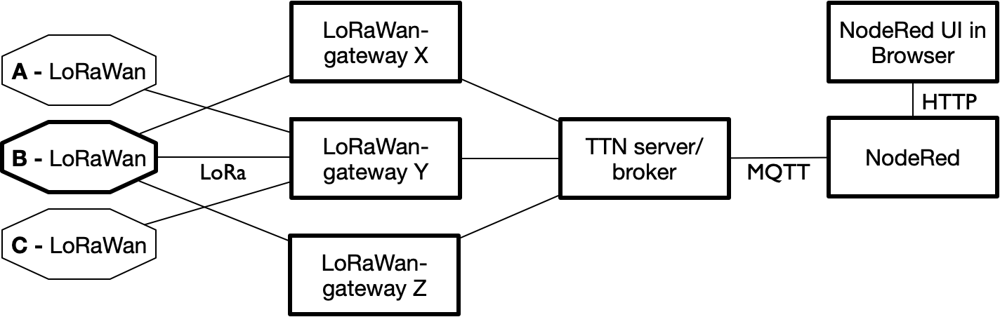

**********
Opdrachten
**********

.. voor lora-knopen

1. TTN-application
==================

TheThingsNetwork (TTN: https://thethingsnetwork.org) is een wereldwijd LoRaWan netwerk gemaakt door een community.
Dit netwerk is voor iedereen gratis te gebruiken.

In deze opdracht gebruik je een TTN-toepassing met actieve IoT-knopen.
Je bestudeert de berichten die deze knopen versturen naar het netwerk.

.. admonition:: Wat heb je nodig?

   * een bestaande TTN-toepassing (application) met actieve IoT-knopen (via je docent).
   * een (gratis) TTN-account, met toegang tot deze TTN-toepassing.

.. figure:: IoT-LoRaWan-console.png
  :width: 600
  :align: center

  LoRaWan toepassing: van IoT-knoop tot TTN-console

De berichten van de LoRa IoT-knopen vind je via het TTN-console:

* log in bij TTN (https://www.thethingsnetwork.org/), en ga naar je *console*;
* selecteer de gegeven *application*;
* selecteer de ``data``-tab; je ziet dan de berichten van de actieve IoT-knopen.

Bekijk de details van een bericht;
klik hiervoor op de regel van het bericht.
Beantwoord de volgende vragen:

1. welke IoT-knoop (device) heeft het bericht verstuurd?
2. wat is de lengte van de *payload* (in bytes)?
3. wat is de geschatte *airtime* van het bericht?
4. door hoeveel *gateways* is het bericht ontvangen?
5. waar staat de eerste gateway?
    * zet zo nodig de coördinaten om in een straatnaam;
      gebruik daarvoor Google Maps of `Open Street Map <https://www.openstreetmap.org>`_
6. kun je deze gateway vinden op de kaart van TTN?
    * zie https://www.thethingsnetwork.org/community
7. hoeveel berichten stuurt de IoT-knoop (ongeveer) per uur en per dag?
8. voldoet de IoT-knoop daarmee aan de TTN "fair access policy"?
9. welke frequenties gebruikt een IoT-knoop achtereenvolgens?
   Waarom gebruikt een LoRa/TTN IoT-knoop verschillende frequenties?
10. wat is de spreading factor (SF) bij de communicatie?
    * zie: https://zakelijkforum.kpn.com/lora-forum-16/spreading-factor-sf-time-on-air-and-adaptive-data-rate-10908
11. wat is de signaalsterkte (rssi)?
    Vergelijke de signaalsterkte voor berichten van verschillende IoT-knopen.
    Kloppen deze (ongeveer) met de afstand van de IoT-knoop tot de gateway?
12. als het bericht door meerdere gateways ontvangen wordt:
    kloppen de signaalsterktes (rssi) voor de verschillende gateways ongeveer met de afstand tot de IoT-knoop?

De onderdelen van een bericht in het data-overzicht:

:Uplink: bericht van IoT-knoop naar LoRaWan-server;
:Downlink: bericht van LoRaWan-server naar IoT-knoop;
:Payload: de oorspronkelijke (binaire) payload van het bericht;
:Fields: de gedecodeerde waarden van de payload (zie application-Payload formats);
:Metadata: de data over de communicatie, bepaald door de gateway;
:Airtime: de tijd dat het bericht het radiokanaal gebruikt.

2. Nodered-TTN-Dashboard
========================

Met NodeRed maak je een dashboard voor de sensordata van een Lora/TTN IoT-knoop.
Hierbij gebruik je de NodeRed-nodes voor TTN.

.. admonition:: Wat heb je nodig?

  * een bestaande TTN-toepassing (application) met actieve IoT-knopen (via je docent);
  * een (gratis) TTN-account, met toegang tot deze TTN-toepassing;
  * een (gratis) FRED-account, of andere NodeRed-server.

  NodeRed-dashboard voor TTN

NodeRed heeft de volgende knopen voor de verbinding met de TTN-server:

+--------------------+------------------+----------------+------------------------+
| **figuur**         | **naam**         | **soort**      | **betekenis**          |
+--------------------+------------------+----------------+------------------------+
| |ttn-uplink|       | ttn-uplink       |  input         | data van ttn-knopen    |
+--------------------+------------------+----------------+------------------------+
| |ttn-event|        | ttn-event        |  input         | events(*)              |
+--------------------+------------------+----------------+------------------------+
| |ttn-downlink|     | ttn-downlink     |  output        | data naar ttn-knopen   |
+--------------------+------------------+----------------+------------------------+

.. |ttn-uplink| image:: nodered-ttn-uplink-node.png
.. |ttn-downlink| image:: nodered-ttn-downlink-node.png
.. |ttn-event| image:: nodered-ttn-event-node.png

Deze nodes gebruiken het MQTT-interface van de TTN-server.

* de *uplink*-node ontvangt de data van een TTN-toepassing of van een enkel device (IoT-knoop).
* via de *downlink*-node stuur je data naar een device (IoT-knoop).
  Downlink-berichten zijn in een LoRaWan-netwerk maar heel beperkt mogelijk.
* de *event*-node ontvangt de meta-data van de TTN-server over een TTN-toepassing of een device (IoT-knoop).
  Een typisch voorbeeld van een event is de registratie van een device bij een gateway.

.. rubric:: Installeren van de TTN-nodes in NodeRed

Voordat je de TTN-nodes kunt gebruiken moet je deze (eenmalig) installeren in NodeRed.

.. Admonition:: Let op

  Het installeren van de TTN-nodes werkt bij FRED anders dan bij een normale NodeRed-installatie.

In het geval van een **FRED-account** (https://fred.sensetecnic.com) gebruik je de volgende stappen:

  * selecteer in het FRED-menu links onder "Tools": "Add or remove nodes";
  * type in het zoekveld: ``ttn``
  * vink aan: TTN - TheThingsNetwork NodeRed application

In een **normale NodeRed-installatie** installeer je de TTN-Nodes als volgt:

* selecteer in het NodeRed UI in het "hamburger menu" rechts boven: "Manage Palette".
* selecteer de tab "install", en type in het zoekveld: ``ttn``
* selecteer het item ``node-red-contrib-ttn``, en klik op "install".
* als het goed is zijn na de installatie de nodes beschikbaar in het palette links.

Als "Manage Palette" niet beschikbaar is, moet de NodeRed-installatie aangepast worden
(vraag via je docent).

Dashboard-flow
--------------

.. figure:: iot-ttn-dashboard-flow.png
  :align: center
  :width: 400px

  Dashboard-flow voor TTN

* kopieer de onderstaande NodeRed-flow, en importeer deze naar een leeg tabblad in NodeRed.

.. code-block:: json

  [{"id":"7865201f.d5d3b","type":"ttn uplink","z":"6a5e1255.8509ec","name":"ttn uplink","app":"","dev_id":"","field":"","x":480,"y":200,"wires":[["bff21cee.9ce63","3a0067cc.cf7f2","f0805976.ff9328","b234b34e.3fc96","a72147cb.239e38"]]},{"id":"bff21cee.9ce63","type":"debug","z":"6a5e1255.8509ec","name":"","active":true,"tosidebar":true,"console":false,"tostatus":false,"complete":"true","x":770,"y":200,"wires":[]},{"id":"3a0067cc.cf7f2","type":"ui_gauge","z":"6a5e1255.8509ec","name":"Temperature","group":"397ba453.3b0e0c","order":0,"width":0,"height":0,"gtype":"gage","title":"Temp","label":"'C","format":"{{payload.celcius}}","min":0,"max":"50","colors":["#00b500","#e6e600","#ca3838"],"seg1":"","seg2":"","x":810,"y":280,"wires":[]},{"id":"f0805976.ff9328","type":"ui_gauge","z":"6a5e1255.8509ec","name":"","group":"febde8db.f65de8","order":0,"width":0,"height":0,"gtype":"gage","title":"Barometer","label":"hPa","format":"{{payload.mbar}}","min":"970","max":"1040","colors":["#00b500","#e6e600","#ca3838"],"seg1":"","seg2":"","x":810,"y":320,"wires":[]},{"id":"af880438.e2c1a8","type":"ui_chart","z":"6a5e1255.8509ec","name":"Temperature","group":"397ba453.3b0e0c","order":0,"width":0,"height":0,"label":"Temperature","chartType":"line","legend":"false","xformat":"HH:mm","interpolate":"linear","nodata":"","dot":false,"ymin":"0","ymax":"50","removeOlder":1,"removeOlderPoints":"","removeOlderUnit":"86400","cutout":0,"useOneColor":false,"colors":["#1f77b4","#aec7e8","#ff7f0e","#2ca02c","#98df8a","#d62728","#ff9896","#9467bd","#c5b0d5"],"useOldStyle":false,"x":810,"y":380,"wires":[[],[]]},{"id":"85ed9f09.ee6ce8","type":"ui_chart","z":"6a5e1255.8509ec","name":"Barometer","group":"febde8db.f65de8","order":0,"width":0,"height":0,"label":"Barometer","chartType":"line","legend":"false","xformat":"HH:mm","interpolate":"linear","nodata":"","dot":false,"ymin":"990","ymax":"1030","removeOlder":1,"removeOlderPoints":"","removeOlderUnit":"86400","cutout":0,"useOneColor":false,"colors":["#1f77b4","#aec7e8","#ff7f0e","#2ca02c","#98df8a","#d62728","#ff9896","#9467bd","#c5b0d5"],"useOldStyle":false,"x":810,"y":420,"wires":[[],[]]},{"id":"b234b34e.3fc96","type":"change","z":"6a5e1255.8509ec","name":"select payload.celcius","rules":[{"t":"set","p":"payload","pt":"msg","to":"payload.celcius","tot":"msg"}],"action":"","property":"","from":"","to":"","reg":false,"x":600,"y":380,"wires":[["af880438.e2c1a8"]]},{"id":"a72147cb.239e38","type":"change","z":"6a5e1255.8509ec","name":"select payload.mbar","rules":[{"t":"set","p":"payload","pt":"msg","to":"payload.mbar","tot":"msg"}],"action":"","property":"","from":"","to":"","reg":false,"x":600,"y":420,"wires":[["85ed9f09.ee6ce8"]]},{"id":"397ba453.3b0e0c","type":"ui_group","z":"","name":"TTN-device-1-temperature","tab":"18f86ddf.f7110a","disp":true,"width":"6","collapse":false},{"id":"febde8db.f65de8","type":"ui_group","z":"","name":"TTN-device-1-barometer","tab":"18f86ddf.f7110a","disp":true,"width":"6","collapse":false},{"id":"18f86ddf.f7110a","type":"ui_tab","z":"","name":"TTN-device-1","icon":"dashboard"}]

* configureer de TTN-uplink-node:
    * *App*: selecteer "Add new ttn app...", en vul de gegevens uit het TTN-console voor de application in (Overview tab):
    * *App ID*: de Application-ID (bovenin de Overview);
    * *Access Key*: één van de Access Keys (onderaan in de Overview);
    * *Discovery address*: (default-waarde laten staan)
    * "Add"
    * *Device ID*: de naam van de node (uit het TTN-console) voor het dashboard
    * "Done"
* configureer de debug-node, met output: complete msg object
* "Deploy".

Je ziet nu (als het goed is) in het bijbehorende dashboard de gegevens van de IoT-knoop verschijnen.
Dit kan even duren, omdat een IoT-knoop met tussenperioden van enkele minuten zendt.

Via de debug-node kun je de metadata van de communicatie tussen de IoT-knoop en de gateway volgen.
Een voorbeeld hiervan zie je hieronder:

.. figure:: lora-metadata.png
  :width: 300px
  :align: center

  Metadata voor TTN-LoRaWan-communicatie

Beantwoord de onderstaande vragen:

1. welke gateway(s) ontvangen de berichten van deze IoT-knoop?
2. welke SF wordt gebruikt?
3. wat is de (geschatte) *air time* van de berichten?

3. Je eigen TTN IoT-knoop
=========================

In deze opdracht koppel je een (voorgeconfigureerde) IoT-knoop aan het TTN-LoRaWan-netwerk.

.. admonition:: Wat heb je nodig?

   * een IoT-LoRaWan-knoop, voorgeprogrammeerd en geconfigureerd voor een
     TTN-toepassing;
   * een (gratis) TTN-account, met toegang tot de genoemde TTN-toepassing.

* log in bij TTN, en ga naar je *console*;
* selecteer de toepassing waartoe de IoT-knoop behoort;
* selecteer in deze toepassing je eigen device (IoT-knoop);
* zet je eigen knoop aan (power on); deze probeert nu verbinding te maken met een gateway;

Bij de IoT-knopen gebaseerd op de Arduino Pro Mini geeft een knipperende led aan dat deze knoop verbinding zoekt met een gateway.
Het maken van een verbinding duurt enkele seconden (voor een gateway in de buurt) tot enkele uren (voor een gateway verder weg).

Bestudeer de berichten van deze knoop bij het aanmelden van de IoT-knoop bij het TTN-netwerk.
Beantwoord de volgende vragen:

1. welke SF-waarden worden geprobeerd voordat het uiteindelijke resultaat bereikt wordt?
2. (...)

4. LoRaWan-toepassingen
=======================

Zoek op het web naar toepassingen van LoRaWan-netwerken.
Aanbieders van LoRaWan (zoals TTN en KPN) kunnen hiervoor inspiratie bieden.

1. Geef 3 voorbeelden van bestaande LoRaWan-toepassingen,
    a) Beschrijf de toepassing, met een verwijzing naar hun beschrijving op het web.
    b) Beschrijf welke waarde deze toepassing heeft, en voor wie;
       en wat de mogelijke nadelen van deze toepassing zijn, en wie deze ondervindt;
    c) Ga na (of maak een redelijke schatting) welke sensordata voor deze toepassing verstuurd moeten worden;
       hoe vaak moeten deze verstuurd worden?
2. Bedenk een eigen toepassing van LoRaWan, bijvoorbeeld voor je eigen omgeving.
   Beschrijf deze toepassing, de waarde die deze toepassing heeft voor de gebruikers,
   en de mogelijke nadelen voor anderen in deze omgeving.

Zie ook:

* https://www.thethingsnetwork.org/labs/
* https://www.thethingsnetwork.org/marketplace
   * o.a. "a better mousetrap"
* https://www.kpn.com/zakelijk/grootzakelijk/internet-of-things/lora-netwerk.htm
