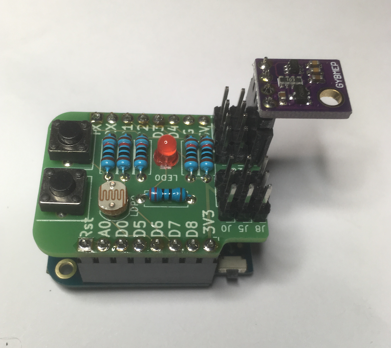

*********
Voorwoord
*********

Welkom bij het materiaal voor het thema: Netwerken/Internet of Things.
Dit materiaal heeft als motto: *Het Internet of Things, dat maak je zelf*.
Je kunt al veel commerciële IoT-producten kopen en commerciële IoT-diensten gebruiken.
Maar het is veel leuker en leerzamer om deze zelf te maken.
Dat is wat ingewikkelder dan het maken van een website in HTML,
maar met dit materiaal zet je de eerste stappen hiervoor.
Alle elementen voor een IoT-toepassing liggen binnen je bereik:
je hebt er voornamelijk tijd, aandacht en enig doorzettingsvermogen voor nodig.

  Zelfbouw WiFi IoT-knoop

Door hiermee bezig te zijn maak je ook kennis met de principes van het internet,
en van netwerken in het algemeen.

Het Internet of Things omvat veel verschillende onderwerpen:
van sensoren en actuatoren tot webdiensten op het gebied van Data Science en Artificial Intelligence.
In dit materiaal komt maar een deel hiervan aan bod:
we concentreren ons op het deel van de "dingen" tot aan het waarnemen (monitoren) en besturen daarvan via het internet:
van de "edge" van het Internet of Things (dichtbij de "dingen) tot de eerste verbindingen met de "cloud"
De verbinding met Data Science en Artificial Intellingence-diensten in de "cloud" komt nauwelijks aan bod.
Bovendien beperken we ons tot eenvoudige sensoren en actuatoren, zoals schakelaars, temperatuursensoren, en LEDs.

Het is niet nodig dat je al de onderwerpen die voor een IoT-toepassing van belang zijn beheerst:
voor een project voor een IoT-toepassing maak je
je kiest er één of twee uit je eigen er je eigen interessegebied,
en je werkt samen met anderen die andere onderdelen voor hun rekening nemen.

Mogelijk heb je niet alle basiskennis op het gebied van communicatie en netwerken nog paraat:
daarvoor kun je eventueel terecht bij het materiaal van Com-0.
Alle hardware en software die we voor IoT-0 gebruiken is Open Source:
aan de hand van IoT-1 kun je de beschrijving van deze hardware en software vinden.
Daar staan ook de aanwijzingen voor het bouwen en programmeren van deze onderdelen.
