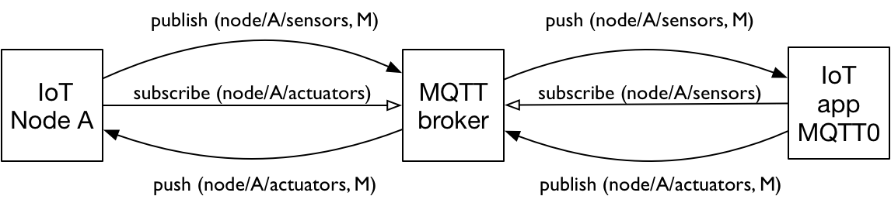

WiFi-MQTT-ketens
================

(spelers/agents en interacties)

* interactie: publish/Subscribe (via MQTT)
* symmetrisch push-protocol (zowel client als broker "pushen" berichten)
* configuratieprobleem? (ssid/wachtwoord lokale WiFi)
* eerste voorbeeld van publieke internet: ook router/gateway als speler

MQTT: Publish-subscribe
-----------------------

.. figure:: MQTT.png
   :width: 500 px
   :align: center

   Publish-subscribe interactie (MQTT)

  MQTT in het Internet of Things

Publieke broker
---------------

* door broker in publieke internet: bediening op afstand
* (eenvoudig in gebruik)
* nadeel:  grotere latency; veiligheid?

.. figure:: IoT-nobridge-1.png
   :width: 600 px
   :align: center

   IoT-knopen met MQTT-broker in het publieke internet

Lokale broker
-------------

* door lokale broker: lagere latency; grotere veiligheid
* lokale broker als bridge naar publieke broker
    * combineren van lage latency en bediening op afstand

.. figure:: IoT-lokale-gateway-1.png
   :width: 600 px
   :align: center

   Lokale MQTT-broker als bridge naar publieke broker
